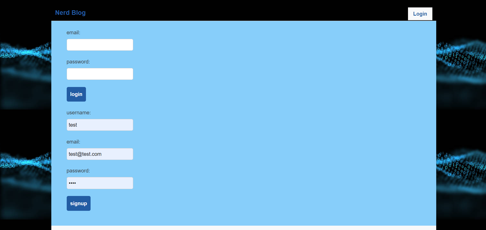
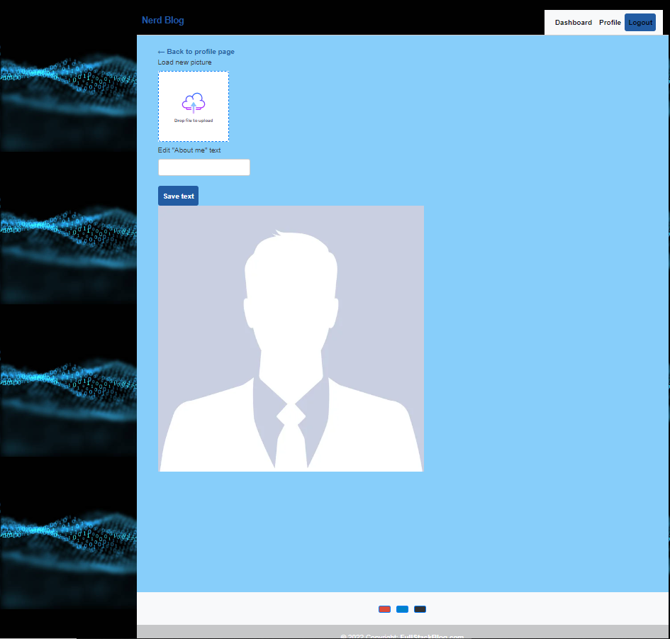
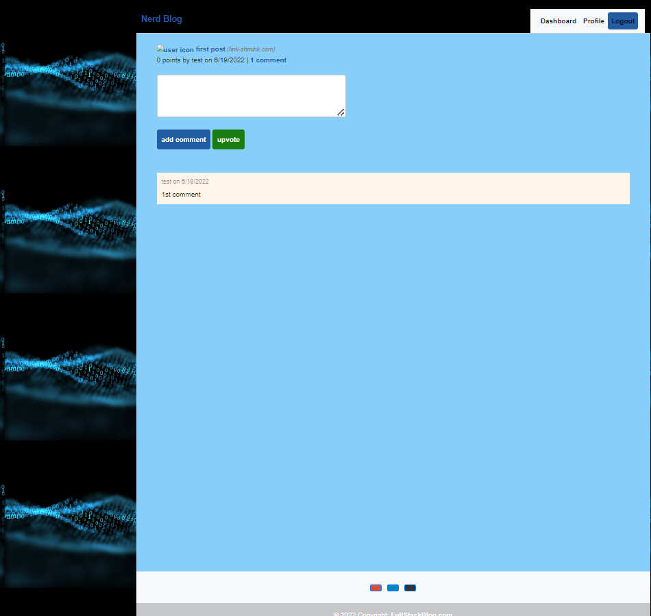

# Nerd Blog

## Description

This Full Stack Blog allows developers to read, post, and manage their posts revolving around the 
world of technology. Users are able to create accounts with secure passwords allowing them to edit 
and delete their posts.

## Table of Contents

- [Installation](#installation)
- [Usage](#usage)
- [Credits](#credits)
- [License](#license)

## Installation

To install the app you need to clone repository to local machine, run "npm i" to install all packages and after start the app with "node server.js".

## Usage

)
)
)

## License

[Link to license: MIT](https://opensource.org/licenses/MIT)
## Badges

## Questions

Here is link to my GitHub profile page: https://github.com/sergiionyx

And also you may contact me via e-mail: twilight.cympak@gmail.com
